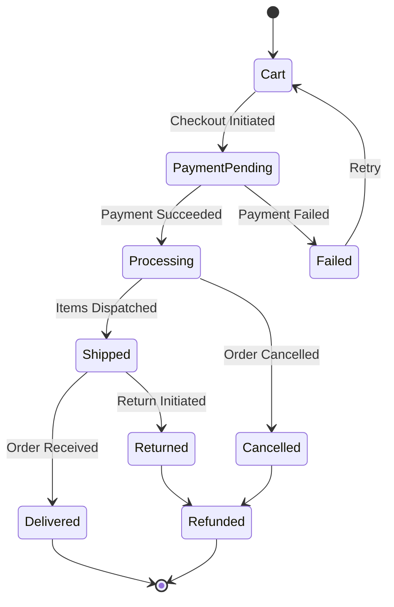

# E-Commerce Backend Architecture Principles

This document outlines the fundamental principles, data models, and workflows for designing a robust and scalable e-commerce backend.

## 1. Core Architectural Principles

A modern e-commerce backend should be built on principles that ensure scalability, reliability, and maintainability.

- **Microservices or Modular Monolith:** While a full microservices architecture can be complex, the principle of modularity is key. The backend should be broken down into logical domains that handle specific business capabilities (e.g., Catalog, Orders, Users, Payments). This allows for independent development, deployment, and scaling.
- **Statelessness:** Application servers should be stateless. All state required to process a request (like session information) should be stored on the client (e.g., in a JWT) or in a dedicated state store (like Redis), not on the application server itself. This allows for easy horizontal scaling.
- **API-First Design:** The backend should expose its functionality through a well-defined, versioned API. This "headless" approach decouples the backend from any specific frontend (web, mobile app), allowing for flexibility in the user experience.
- **Asynchronous Operations:** For long-running tasks like processing payments, sending emails, or updating inventory, use a message queue (e.g., RabbitMQ, Kafka) to handle them asynchronously. This prevents blocking the main thread and improves application responsiveness.

## 2. Core Data Models

The data schema is the foundation of the e-commerce system. The following models represent the core entities and their relationships. This project uses Mongoose (NoSQL), so the schema is presented in that style.

### User
Stores customer and vendor/admin information.

- **`name`**: String, Required
- **`email`**: String, Required, Unique
- **`passwordHash`**: String, Required
- **`roles`**: Array of Strings (e.g., `['user', 'vendor', 'admin']`), Required
- **`addresses`**: Array of `Address` sub-documents
- **`paymentMethods`**: Array of `PaymentMethod` sub-documents (Could also be stored with the payment provider)
- **`createdAt`**, **`updatedAt`**: Timestamps

### Address (Sub-document of User)
A user can have multiple shipping addresses.

- **`name`**: String, Required (Recipient's name for this address)
- **`phone`**: String, Required
- **`company`**: String
- **`line1`**, **`line2`**: String
- **`city`**, **`state`**, **`pincode`**, **`country`**: String, Required
- **`isDefault`**: Boolean

### Product
The central entity for items sold.

- **`name`**: String, Required
- **`description`**: String
- **`brand`**: String, Required
- **`category`**: ObjectId, Ref: 'Category', Required
- **`images`**: Array of Strings (URLs)
- **`basePrice`**: Number, Required (for products without variants)
- **`options`**: Array of `Option` sub-documents (e.g., defines that this product has "Size" and "Color" options)
- **`variants`**: Array of `Variant` sub-documents (for products with different options like size/color)
- **`vendor`**: ObjectId, Ref: 'User', Required
- **`isActive`**: Boolean (to enable/disable product visibility)

### Option (Sub-document of Product)
Defines an option type and its possible values.

- **`name`**: String (e.g., "Size")
- **`values`**: Array of Strings (e.g., ["S", "M", "L"])

### Variant (Sub-document of Product)
Represents a specific, purchasable version of a product.

- **`options`**: Map (e.g., `{ "Size": "M", "Color": "Blue" }`)
- **`price`**: Number, Required
- **`stock`**: Number, Required
- **`sku`**: String, Unique (Stock Keeping Unit)
- **`images`**: Array of Strings (URLs specific to this variant)

### Category
Used to organize products.

- **`name`**: String, Required, Unique
- **`slug`**: String, Unique (for clean URLs)
- **`parentCategory`**: ObjectId, Ref: 'Category' (for sub-categories)

### Cart
A temporary holder for items a user intends to buy. Can be tied to a logged-in user or a guest session.

- **`user`**: ObjectId, Ref: 'User'
- **`guestId`**: String
- **`items`**: Array of `CartItem` sub-documents
- **`expiresAt`**: Date (to automatically clear old carts)

### CartItem (Sub-document of Cart)
- **`product`**: ObjectId, Ref: 'Product'
- **`variant`**: ObjectId (if applicable)
- **`quantity`**: Number
- **`price`**: Number (snapshot of the price when added)

### Order
A permanent record of a completed transaction.

- **`orderNumber`**: String, Required, Unique
- **`user`**: ObjectId, Ref: 'User'
- **`guestId`**: String
- **`items`**: Array of `OrderItem` sub-documents, Required
- **`totalAmount`**: Number, Required
- **`shippingAddress`**: A copy of the address used for this specific order.
- **`status`**: String, Enum (See Order Processing Lifecycle)
- **`paymentDetails`**: Object containing payment status, transaction ID, etc.

### OrderItem (Sub-document of Order)
A snapshot of a product as it was ordered.

- **`product`**: ObjectId, Ref: 'Product'
- **`quantity`**: Number
- **`priceAtPurchase`**: Number
- **`options`**: Map (e.g., `{ "Size": "M", "Color": "Blue" }`)
- **`name`**, **`brand`**, **`image`**: String (denormalized/copied from Product for historical record)

## 3. Order Processing Lifecycle (State Machine)

An order progresses through a series of states.

- **PaymentPending:** An order record is created, but payment is not yet confirmed. Inventory is temporarily reserved.
- **Processing:** Payment is confirmed. The warehouse is notified to prepare the shipment.
- **Shipped:** The package is with the courier. A tracking number is associated.
- **Delivered:** The package has been delivered.
- **Cancelled/Returned/Refunded:** Terminal states. If an order is cancelled or returned, inventory must be added back.

## 4. API Endpoint Design (RESTful Examples)

- **Products & Categories**
  - `GET /api/products`: List all products (with filtering, sorting, pagination).
  - `GET /api/products/:id`: Get a single product.
  - `GET /api/categories`: List all categories.
  - `GET /api/categories/:slug/products`: Get products in a specific category.

- **Authentication**
  - `POST /api/auth/register`: Create a new user account.
  - `POST /api/auth/login`: Authenticate a user and receive a JWT.

- **User Account (`/api/users/me` requires authentication)**
  - `GET /api/users/me/profile`: Get the current user's profile.
  - `PUT /api/users/me/profile`: Update the user's profile.
  - `GET /api/users/me/addresses`: Get the user's saved addresses.
  - `POST /api/users/me/addresses`: Add a new address.

- **Cart (`/api/cart` requires authentication or guest session)**
  - `GET /api/cart`: Get the user's current cart.
  - `POST /api/cart/items`: Add an item to the cart.
  - `PUT /api/cart/items/:itemId`: Update an item's quantity.
  - `DELETE /api/cart/items/:itemId`: Remove an item.

- **Checkout & Orders (`/api/orders` requires authentication)**
  - `POST /api/orders`: Create a new order from the current cart. This is the most complex endpoint, involving payment processing and inventory updates.
  - `GET /api/orders`: Get the user's order history.
  - `GET /api/orders/:orderNumber`: Get details of a specific order.

## 5. Key Business Logic

- **Inventory Management:** Stock levels must be decremented atomically when an order is successfully placed. A "stock reservation" system is crucial to prevent overselling while a user is in the payment process. If payment fails or the cart expires, the reservation is released.
- **Payment Gateway Integration:** The backend should never handle raw credit card information.
  1. The frontend gets a one-time-use token from the payment provider (e.g., Stripe, Razorpay).
  2. The frontend sends this token to the backend.
  3. The backend uses the token to create a "charge" or "intent" via the provider's API.
  4. The backend listens for a `webhook` from the payment provider to confirm the payment was successful before moving the order `status` to 'Processing'.
- **Authentication & Authorization:** The system must differentiate between guests, authenticated users, and admins/vendors. Middleware should protect routes, ensuring only users with the correct roles can perform certain actions (e.g., only an admin can create a product, only a user can view their own order history).
